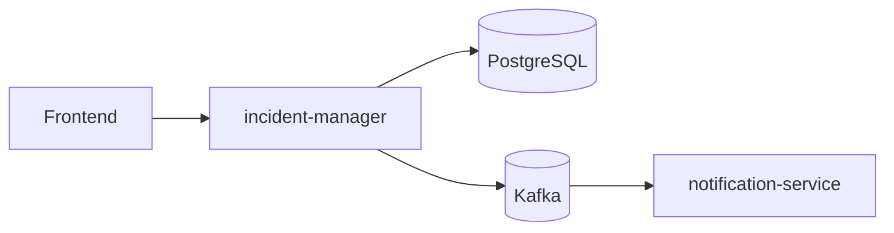
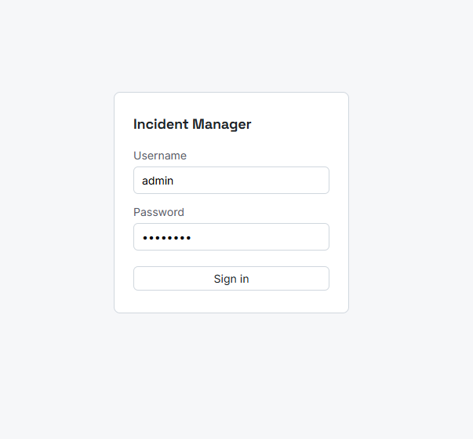
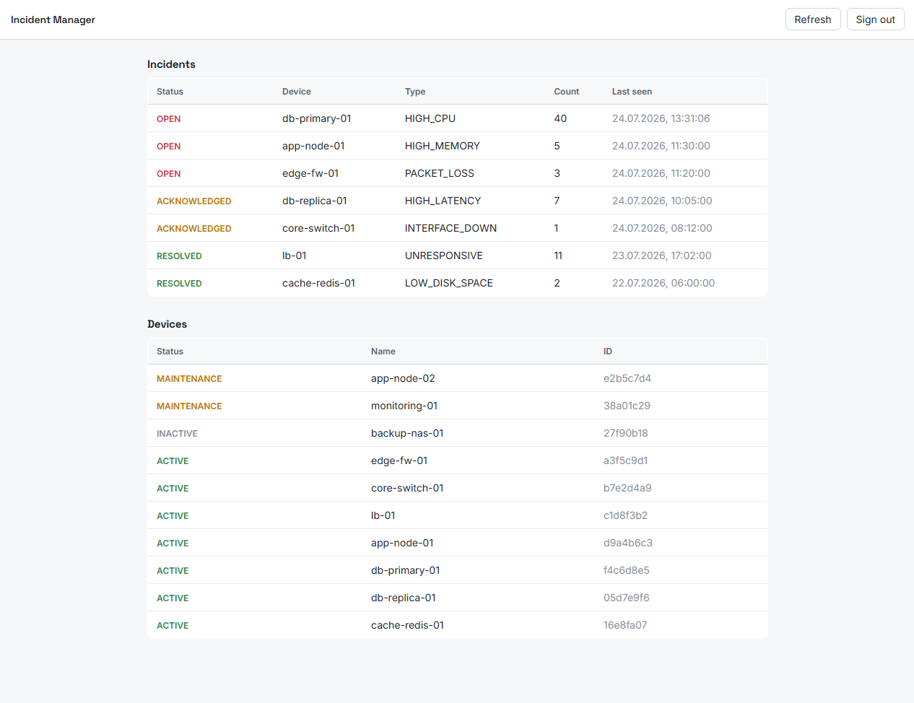
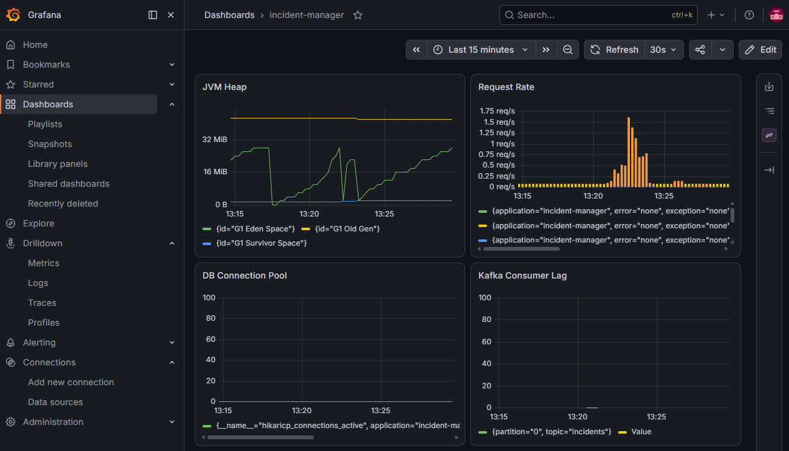

# Incident Manager


Incident Manager is a backend project I built to practice building a complete,
realistic system on my own. I have a background in networking and IT
infrastructure, so I picked a problem I understand well: keeping track of devices
and turning their repeated problems into incidents that someone can act on.

The system watches devices. When a device reports the same problem often enough,
escalation rules turn those events into an incident. A separate notification
microservice then sends a notification over Kafka. I split the system into two
services on purpose, so they can be deployed and scaled independently. There is
also a small React frontend, so you can log in and see the data in the browser.

## Contents

- [Architecture](#architecture)
- [Tech stack](#tech-stack)
- [Getting started](#getting-started)
- [Project structure](#project-structure)
- [API](#api)
- [Screenshots](#screenshots)
- [Tests](#tests)
- [Observability](#observability)
- [Roadmap](#roadmap)
- [License](#license)

## Architecture

The project is a monorepo with two Spring Boot microservices — a core service
and a notification service — that communicate over Kafka, plus a React client.



The core service (`incident-manager`) uses a hexagonal (ports & adapters)
layout, so the domain does not depend on Spring or the database:

- **domain** – the model (`Device`, `Event`, `Incident`, `EscalationRule`) and
  the ports (interfaces the domain needs, like repositories).
- **application** – use cases that call the ports and run the domain logic.
- **adapters/in** – REST controllers.
- **adapters/out** – JPA persistence and Kafka publishing. These implement the
  ports.
- **config / security** – wiring and the JWT setup.

How it works: a device reports events, the escalation rules decide when repeated
events become an incident, and the new incident is published to Kafka as an
`IncidentCreated` event. The `notification-service` reads that event and sends a
notification (simulated). Messages it cannot process go to a dead-letter topic.
Requests are traced across both services with OpenTelemetry.

## Tech stack

- Java 21, Spring Boot 4
- Spring Web, Spring Data JPA, Spring Security (JWT / OAuth2 resource server)
- PostgreSQL with Flyway migrations
- Apache Kafka for messaging between services
- MapStruct for entity/domain mapping
- Micrometer Tracing + OpenTelemetry
- Actuator + Prometheus + Grafana
- JUnit 5, Mockito, Testcontainers
- React + TypeScript + Vite (frontend)
- Gradle (Kotlin DSL), GitHub Actions for CI

## Getting started

You need JDK 21, Docker, and Node.js.

**1. Start the infrastructure** (Postgres, Kafka, Prometheus, Grafana):

```bash
docker compose up -d
```

**2. Run the core service** (migrations run on startup):

```bash
cd incident-manager
./gradlew bootRun
```

The API starts on http://localhost:8080.

**3. Run the notification service:**

```bash
cd notification-service
./gradlew bootRun
```

**4. Run the frontend:**

```bash
cd frontend
npm install
npm run dev
```

Open http://localhost:5173 and log in with the default account:

```
username: admin
password: admin123
```

The JWT secret has a development default. You can change it with the
`JWT_SECRET` environment variable.

## Project structure

```
incident-manager/       core service: REST API, domain, escalation, security
notification-service/   Kafka consumer that sends notifications
frontend/               React + Vite client (login + dashboard)
grafana/                dashboards and provisioning
docker-compose.yml      Postgres, Kafka, Prometheus, Grafana
```

## API

Some of the main endpoints. Everything except login needs a JWT:

| Method | Path | Description |
| ------ | ---- | ----------- |
| POST | `/auth/login` | Log in, returns a JWT |
| GET  | `/devices` | List devices |
| POST | `/devices` | Add a device |
| POST | `/devices/{id}/events` | Record an event for a device |
| GET  | `/incidents` | List incidents |
| POST | `/incidents/{id}/acknowledge` | Acknowledge an incident |
| POST | `/incidents/{id}/resolve` | Resolve an incident |

## Screenshots

Login (JWT authentication):



Dashboard (incidents and devices):



Grafana metrics:



## Tests

Unit tests cover the domain and the use cases (JUnit 5 + Mockito). The controller
and security tests use Testcontainers, so they run against a real PostgreSQL
database instead of mocks.

```bash
cd incident-manager
./gradlew test
```

CI runs the tests on every push and pull request to `main`.

## Observability

Both services expose Actuator metrics in Prometheus format. Prometheus scrapes
them and Grafana shows them. The provisioning and a starter dashboard are in
`grafana/`. When you run it locally, Grafana is on http://localhost:3000
(admin / admin) and Prometheus on http://localhost:9090.

## Roadmap

Phase 1 (done): the core domain, escalation rules, Kafka and the notification
service, JWT security, observability, CI, and the small frontend.

Next steps I want to add:

- Kubernetes manifests to run it locally
- Deploy to AWS (RDS, ECR, ECS Fargate)
- Test coverage reports with JaCoCo
- An AI advisor service that suggests fixes based on past incidents

## License

MIT — see [LICENSE](LICENSE).
