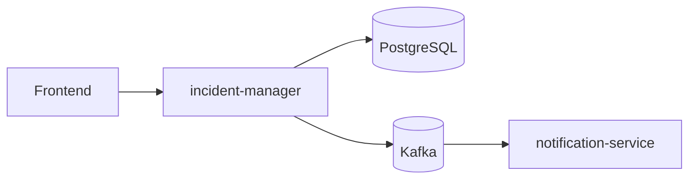
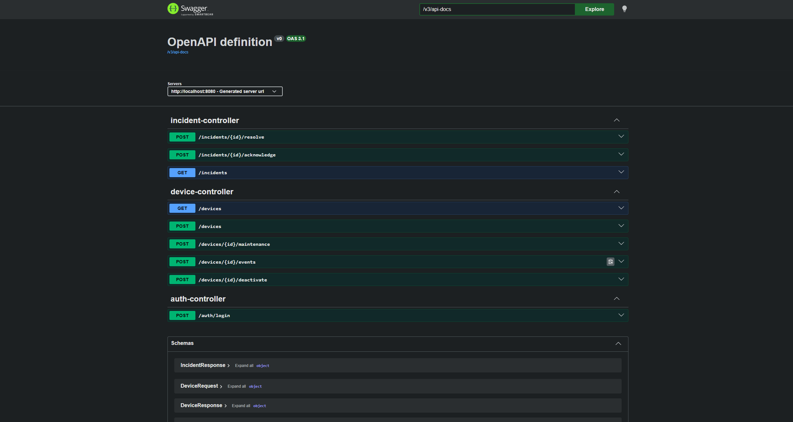
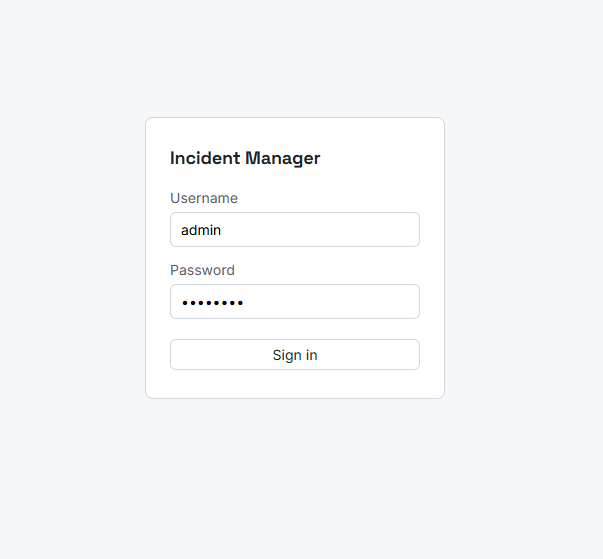
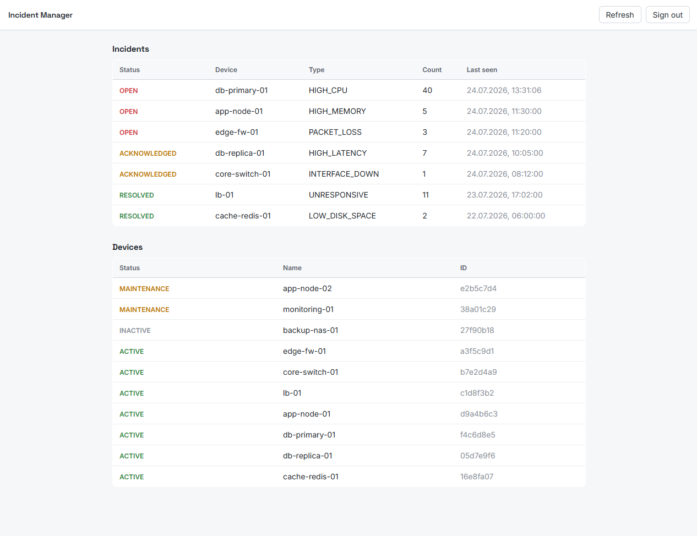
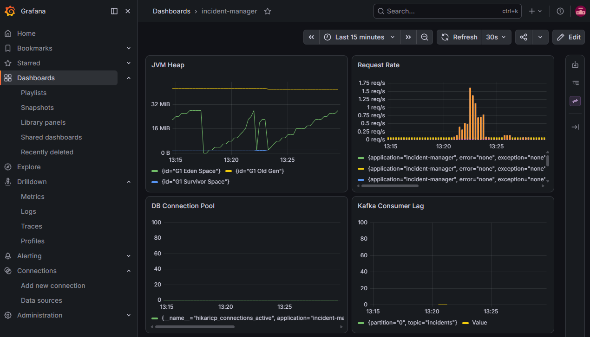

# Incident Manager


Incident Manager is a backend project I built to practice building a complete,
realistic system on my own. I have a background in networking and IT
infrastructure, so I picked a problem I understand well: keeping track of devices
and turning their repeated problems into incidents that someone can act on.

The system watches devices. When a device reports the same problem often enough,
escalation rules turn those events into an incident. A separate notification
microservice then sends a notification over Kafka. I split the system into two
services on purpose, so they can be deployed and scaled independently. There is
also a small React frontend, so you can log in and see the data in the browser.

## Contents

- [Architecture](#architecture)
- [Tech stack](#tech-stack)
- [Getting started](#getting-started)
- [Project structure](#project-structure)
- [API](#api)
- [Screenshots](#screenshots)
- [Tests](#tests)
- [Observability](#observability)
- [Kubernetes](#kubernetes)
- [Roadmap](#roadmap)
- [License](#license)

## Architecture

The project is a monorepo with two Spring Boot microservices — a core service
and a notification service — that communicate over Kafka, plus a React client.


```mermaid
flowchart LR
  UI[Frontend] --> API[incident-manager]
  API --> DB[(PostgreSQL)]
  API --> Kafka[(Kafka)]
  Kafka --> NS[notification-service]
```

The core service (`incident-manager`) uses a hexagonal (ports & adapters)
layout, so the domain does not depend on Spring or the database:

- **domain** – the model (`Device`, `Event`, `Incident`, `EscalationRule`) and
  the ports (interfaces the domain needs, like repositories).
- **application** – use cases that call the ports and run the domain logic.
- **adapters/in** – REST controllers.
- **adapters/out** – JPA persistence and Kafka publishing. These implement the
  ports.
- **config / security** – wiring and the JWT setup.

How it works: a device reports events, the escalation rules decide when repeated
events become an incident, and the new incident is published to Kafka as an
`IncidentCreated` event. The `notification-service` reads that event and sends a
notification (simulated). Messages it cannot process go to a dead-letter topic.
Requests are traced across both services with OpenTelemetry.

## Tech stack

- Java 21, Spring Boot 4
- Spring Web, Spring Data JPA, Spring Security (JWT / OAuth2 resource server)
- PostgreSQL with Flyway migrations
- Apache Kafka for messaging between services
- MapStruct for entity/domain mapping
- springdoc OpenAPI with Swagger UI
- Micrometer Tracing + OpenTelemetry
- Actuator + Prometheus + Grafana
- JUnit 5, Mockito, Testcontainers, JaCoCo
- React + TypeScript + Vite (frontend)
- nginx serving the frontend and proxying the API
- Docker and Docker Compose (everything runs in containers)
- Kubernetes manifests for running the whole stack on a local cluster
- Gradle (Kotlin DSL), GitHub Actions for CI

## Getting started

You need Docker.

**1. Create your `.env` file:**

```bash
cp .env.example .env
```

Open it and set your own values, especially `JWT_SECRET`. It has no default, so
the app will not start without it.

**2. Start everything:**

```bash
docker compose up -d
```

This builds and runs both services and the frontend, together with Postgres,
Kafka, Prometheus and Grafana. The frontend is served by nginx, which also
proxies the API calls to the core service.

Open http://localhost:5173 and log in:

```
username: admin
password: admin123
```

This account is created only when the `dev` profile is active, which is the case
in Docker Compose.

## Project structure

```
incident-manager/       core service: REST API, domain, escalation, security
notification-service/   Kafka consumer that sends notifications
frontend/               React + Vite client, nginx config for the container
grafana/                dashboards and provisioning
k8s/                    Kubernetes manifests (deployments, services, config, secrets)
docker-compose.yml      runs everything: both services, frontend, Postgres, Kafka, Prometheus, Grafana
```

## API

The full API is documented with OpenAPI. When the app is running, the docs are at
http://localhost:8080/swagger-ui.html and the raw specification at
http://localhost:8080/v3/api-docs.



The main endpoints. Everything except login needs a JWT:

| Method | Path | Description |
| ------ | ---- | ----------- |
| POST | `/auth/login` | Log in, returns a JWT |
| GET  | `/devices` | List devices, paged with `page` and `size` |
| POST | `/devices` | Add a device |
| POST | `/devices/{id}/events` | Record an event for a device |
| GET  | `/incidents` | List incidents, paged with `page` and `size` |
| POST | `/incidents/{id}/acknowledge` | Acknowledge an incident |
| POST | `/incidents/{id}/resolve` | Resolve an incident |

Both list endpoints default to `page=0` and `size=20`. The page size is capped at
100, so a client cannot ask for the whole table in one request.

## Screenshots

Login (JWT authentication):



Dashboard (incidents and devices):



Grafana metrics:



## Tests

Unit tests cover the domain and the use cases (JUnit 5 + Mockito). The controller
and security tests use Testcontainers, so they run against a real PostgreSQL
database instead of mocks.

```bash
cd incident-manager
./gradlew test
```

JaCoCo generates a coverage report at
`incident-manager/build/reports/jacoco/test/html/index.html` after the tests run.
Coverage is highest where the logic is (domain and use cases) and low in the
adapters, which are mostly generated mappers and JPA entities.

CI runs the tests on every push and pull request to `main`.

## Observability

Both services expose Actuator metrics in Prometheus format. Prometheus scrapes
them and Grafana shows them. The provisioning and a starter dashboard are in
`grafana/`. When you run it locally, Grafana is on http://localhost:3000
(admin / admin) and Prometheus on http://localhost:9090.

## Kubernetes

The `k8s/` folder has manifests to run the whole stack on a local cluster. I used
the Kubernetes built into Docker Desktop, so images I build locally are visible
to the cluster without pushing them to a registry.

```bash
docker build -t incident-manager:1.1 ./incident-manager
docker build -t notification-service:1.0 ./notification-service
docker build -t frontend:1.0 ./frontend

kubectl apply -f k8s/
kubectl get pods -n incident-manager
```

```
NAME                                    READY   STATUS    RESTARTS   AGE
frontend-5b84658d49-4kh6c               1/1     Running   0          8m7s
incident-manager-5889497496-6bw2v       1/1     Running   0          16m
kafka-84cc478988-dkv68                  1/1     Running   0          11m
notification-service-69fd44b845-m6n9x   1/1     Running   0          11m
postgres-684f754476-4bq6b               1/1     Running   0          64m
```

The services are ClusterIP only, so use port-forward to reach them:

```bash
kubectl port-forward -n incident-manager svc/frontend 5173:80
kubectl port-forward -n incident-manager svc/incident-manager 8888:8080
```

Both Spring Boot services use a startupProbe on `/actuator/health/readiness`. A
Java application needs more time to start than a liveness probe would normally
allow, so the startup probe holds the other two back until the application is up.
Configuration comes from ConfigMaps and passwords from Secrets.

The secrets in `k8s/` contain local development values only. In a real cluster
they would come from Sealed Secrets, the External Secrets Operator or a cloud
secret manager.

## Roadmap

Phase 1 (done): the core domain, escalation rules, Kafka and the notification
service, JWT security, observability, CI, and the small frontend.

Phase 2 (done): everything runs in containers and starts with one command,
secrets moved to environment variables, coverage reports with JaCoCo, paging on
the list endpoints, OpenAPI documentation, and Kubernetes manifests for a local
cluster.

Next: an AI advisor that suggests fixes based on past incidents. I want to build
it properly instead of just calling an API, so it needs a vector search over
closed incidents, a timeout and a circuit breaker, and a cache, and the system
has to keep working when the model does not answer.

I also considered deploying this to AWS. I put that aside for now, because I
would rather have a demo that actually runs than manifests I never use.


## License

MIT — see [LICENSE](LICENSE).
